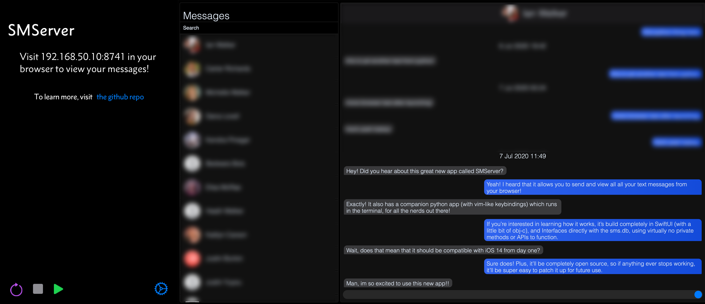

# SMServer

The web interface shown with personal information blurred out

**SMServer is an iPhone app, written in SwiftUI, which allows for one to send and receive text messages (and iMessages) from their Web browser**

## Features
- Viewing all texts & iMessages from another device
- TLS
- Desktop Notifications upon new text arrival
- Sending iMessages remotely, without on-device interaction
- Sending all types of attachments from desktop
- Ability to browse and send attachments from host device camera roll
- Authentication to protect against spying eyes
- Background operation of server for unlimited time, with screen on or off
- Easy and accessible customization options
- Ability to set custom css rules for easy web interface customization
- Easy to use and very customizable search API
- Sending and viewing of read receipts
- Easy switching between Light, Dark, and Nord themes
- Typing indicators when you or other party starts composing
- Information on web interface about battery level and charging state

### Caveats
- One must run this on a jailbroken iPhone. It will crash on a non-jailbroken phone.
- Technically, the webclient conflicts with the LastPass browser extension, but I have not seen any issues because of it. It simply throws errors in the console of your browser, which can be easily ignored and appear not to hurt anything.

### Dependencies
- libsmserver, the tweak which allows sending texts with this app. You can get it from [here](https://github.com/iandwelker/libsmserver).
- To install the ipa (NOT the deb): some signing service/bypass &mdash; Whether this be signing via Xcode, AltServer, etc. or using AppSync Unified to bypass signing checks, any works. I'd recommend AppSync since you won't have to manually sign it, but if that doesn't work for you, then feel free to sign & install the .ipa. The .deb does not require signing or any sort of bypass, since it installs as a system application.

## To Install
Use the provided .ipa or .deb package under the Releases, or read `docs/INSTALL.md` for information on how to build from source.

The source code may be updated past the latest released version, so don't be surprised or confused if you see new features listed on the README or under `docs/Changelog.md` that you don't see in the app yet.

## To run
1. Open the SMServer app, and click the green 'play' button in the bottom left.
3. Open your browser to the ip/port combo specified at the top of the view
4. Authenticate with the default password ('toor'), or your own custom password if you already set one
5. Enjoy!
6. (Optional) Customize the defaults under the settings section of the app to better fit your needs 

<!--## TODO
- [x] View conversations in browser
- [x] View texts in browser
- [x] Dynamic loading of texts
- [x] Send texts from browser without on-device interaction
- [x] Start new conversations from browser
- [x] View all attachments in browser
- [x] Send images/attachments from browser
- [x] Websockets for instant communication
- [x] Display for which conversations have unread messages
- [x] Persistent settings
- [x] Allow the server to run in the background for unlimited time
- [x] Convenient Custom CSS Loading
- [x] HTTPS
- [x] Desktop notifications
- [x] Access to camera roll on web interface
- [x] Viewing and sending of read receipts
- [x] Graphic displays for reactions
- [x] Information on web page about battery life and charging state
- [x] Display when other party starts typing
- [x] Ability to send chat indicators when you start typing
- [x] Subject lines for texts on web interface
- [ ] Ability to send reactions from web interface - This is nearly done
- [ ] Search through messages from browser - This has been implemented in the API
- [ ] Ability to delete conversations from the web interface-->

## Issues
If there are any issues, questions, or feature requests at all, don't hesitate to create an issue or pull request here, or email me at contact@ianwelker.com. I will not run into all issues that could possibly come up, so I would really appreciate any issues you let me know about.

### Acknowledged issues:
- Although typing indicators do appear when the other party starts typing, they don't always disappear when they stop typing. This is also being worked on.

### To file an issue:
Please include the following information:
 - Device model
 - Jailbreak (e.g. checkra1n, unc0ver, Chimera, etc)
 - iOS Version
 - How you installed the app
 - A detailed description of what failed
 - What version of SMServer & libsmserver you're running
 - And if the app crashed & you can get it, a crash log

Also, if the app did not crash on startup, but rather crashed after it was already up and running, I would appreciate if you could do the following: 
 - Install the package 'oslog' from your package manager
 - ssh into your device and run (as root): `oslog --debug | grep -i -e "SMServer_app" -e "mryipc"`; do not redirect the output into a file.
 - Enable debug on the app, then hit the purple 'refresh' button in the bottom left of the main view.
 - Start the app and let it reach the error point
 - Manually copy the output from the above command (as much as you can get) into a text file.
 - Email me the file at contact@ianwelker.com. This file may have sensitive information, such as contact phone numbers, so it wouldn't be smart to upload it to a public site. Feel free to filter out (with something like regex or by hand) the sensitive information. 

## Companion App
There is a [python app](http://github.com/iandwelker/smserver_receiver), based on curses, which I would highly recommend one use in conjunction with this app. It is significantly faster than the web interface, much easier to navigate, more easily customizable, and handles authenticates for you. You can get it at the link above; it has all the information necessary to get it up and running. As always, just ask or open an issue if you have a question. 

## Donations
If you'd like to support development of this project, I really appreciate that, but I would ask that you instead consider donating to more worthy causes, such as [Save the Children](https://support.savethechildren.org/site/Donation2?df_id=2521&2521.donation=form1), who are helping with the humanitarian crisis in Yemen, or [Diasporans against SARS](https://www.gofundme.com/f/4ppyfs-diasporans-against-sars?utm_source=twitter&utm_medium=social&utm_campaign=m_pd+share-sheet), fighting injustice in Nigeria. \
Lastly, if you are a supporter of blue lives matter, Donald Trump, or any hateful organization such as the Proud Boys, you are not welcome to use my software. I would not like to shut down conversation, and would really love to discuss these issues with you. However, racism and hatred have festered long enough in the US, and supporting the aforementioned organizations and individual(s) does nothing but exacerbate these problems.
